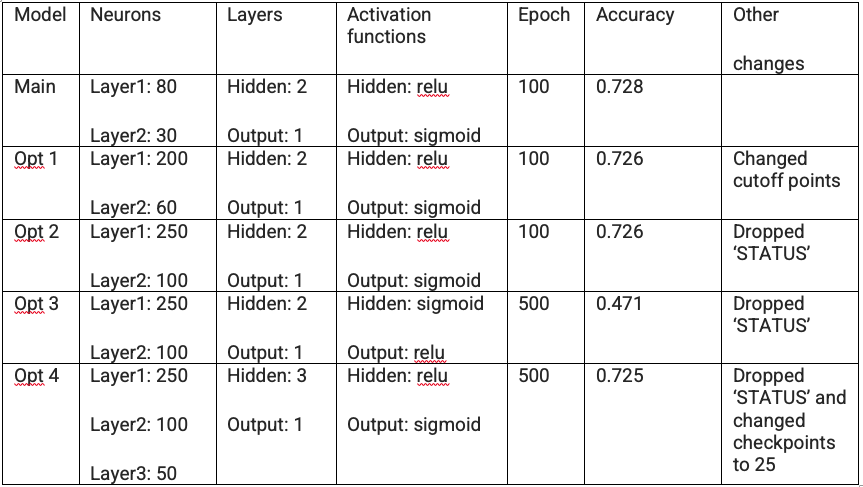

# Neural_Network_Charity_Analysis
## Overview of the analysis: 

Use our knowledge of machine learning and neural networks to create a model predicting successful funding of an applicant. Alphabet Soup our client provided more than 34,000 organizations which have requested funds.

## Results: 
The first goal was to look at the data given and decide what variables were of interest. 

Data Preprocessing
*  Our target variable was IS_SUCCESSFUL.  This variable was used to train the model to predict for future use. 
*  In the first model, we removed EIN and NAME. 

Compiling, Training, and Evaluating the Model

The Table below describes changes that were made within the different models.  “Opt” is short for optimization so we can tell what was changed in each file. 

## Summary: 

The different models were unable to achieve greater than 75% accuracy.  In fact, the best performance was seen in the first model generated.  The accuracy difference between the model was little expect when I adjusted what activation function was used in the hidden and output layers.  The keys to getting better accuracy might be in removing more columns that are not helpful.  

